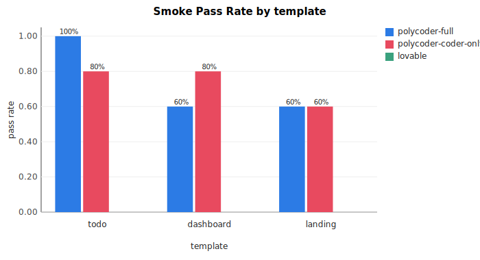
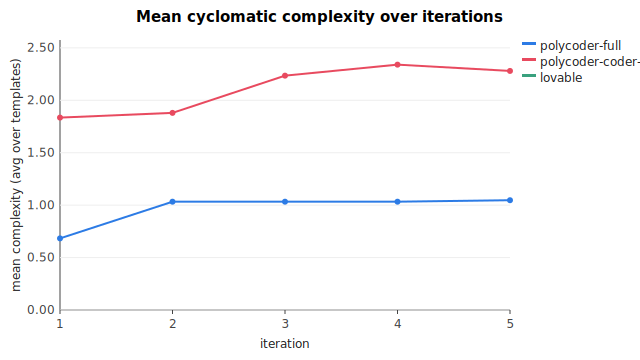

# IST aggregated results

Generated at: 2026-05-08T18:39:38.120Z

Systems: polycoder-full, polycoder-coder-only, lovable
Templates: todo, dashboard, landing

## Per-system headline

| System | iters | BPR | SPR | TCMR | breaks | CCD drift @ iter5 |
|--------|------:|----:|----:|-----:|-------:|------------------:|
| polycoder-full | 15 | 100% | 73% | — | 4 | 0.36 |
| polycoder-coder-only | 15 | 100% | 73% | — | 4 | 0.28 |
| lovable | 0 | — | — | — | 0 | — |

## Per-cell detail

| System | Template | iters | BPR | SPR | TCMR | breaks | longest break | CCD iter1 | CCD iter5 | drift |
|--------|----------|------:|----:|----:|-----:|-------:|--------------:|----------:|----------:|------:|
| polycoder-full | todo | 1,2,3,4,5 | 100% | 100% | — | 0 | 0 | 1.00 | 1.00 | 0.00 |
| polycoder-full | dashboard | 1,2,3,4,5 | 100% | 60% | — | 2 | 2 | 0.00 | 1.09 | 1.09 |
| polycoder-full | landing | 1,2,3,4,5 | 100% | 60% | — | 2 | 2 | 1.05 | 1.05 | 0.00 |
| polycoder-coder-only | todo | 1,2,3,4,5 | 100% | 80% | — | 1 | 1 | 1.67 | — | — |
| polycoder-coder-only | dashboard | 1,2,3,4,5 | 100% | 80% | — | 1 | 1 | 2.00 | 2.28 | 0.28 |
| polycoder-coder-only | landing | 1,2,3,4,5 | 100% | 60% | — | 2 | 2 | — | — | — |
| lovable | todo |  | — | — | — | 0 | 0 | — | — | — |
| lovable | dashboard |  | — | — | — | 0 | 0 | — | — | — |
| lovable | landing |  | — | — | — | 0 | 0 | — | — | — |

## Warnings

- no metrics for lovable/todo
- no metrics for lovable/dashboard
- no metrics for lovable/landing

## Charts

