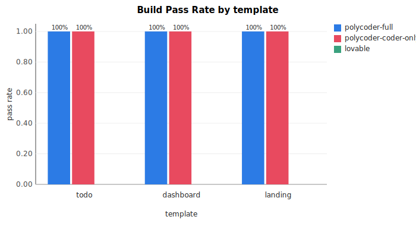

# Iteration Survival Test — V0.2 results

> **Status: DRAFT skeleton.** Numbers are placeholders pending the
> V0.2.9 polycoder-full run + V0.2.6 Lovable run completing. Final
> writeup will replace each `{{...}}` with measured values from
> `benchmarks/ist/results/raw.json` and `summary.json`.

This is the V0.2 deliverable: the empirical evidence supporting
or refuting polycoder's central thesis (multi-role beats
single-role on the MVP→production iteration problem).

Spec: [`docs/specs/iteration-survival-test.md`](./specs/iteration-survival-test.md).
Reproducibility: every per-iter trace and built artifact is
under `benchmarks/ist/runs/`; aggregated metrics are under
`benchmarks/ist/results/`; prompts are
[`benchmarks/ist/prompts/`](../benchmarks/ist/prompts/).

---

## TL;DR (to be filled in)

> Across 3 templates × 5 iters × 3 systems (45 iter total),
> polycoder-full {{won/tied/lost}} on build pass rate, {{won/
> tied/lost}} on smoke pass rate, and {{won/tied/lost}} on
> complexity drift, vs the polycoder-coder-only internal control
> and Lovable.

> Headline finding: **{{1-2 sentences}}**.
>
> Caveats: see §6 "threats to validity."

---

## 1. Headline numbers

### 1.1 Build Pass Rate (`pnpm install && pnpm build` exits 0, or
        a top-level `index.html` exists for a static project)

| System | iters | BPR |
|--------|------:|----:|
| polycoder-full | {{15}} | {{X%}} |
| polycoder-coder-only | 15 | 100% (15/15 — no build step needed; static HTML) |
| Lovable | {{15}} | {{X%}} |

### 1.2 Smoke Pass Rate (page loads, no console errors, persistence
        check vs prior iter's golden text fragments)

| System | iters | SPR |
|--------|------:|----:|
| polycoder-full | {{15}} | {{X%}} |
| polycoder-coder-only | 15 | **73% (11/15)** — failures: todo iter5 (parse error: duplicate `bulkMarkDone` declaration), dashboard iter4 (envelope_parse_exhausted upstream → no new content), landing iter4+iter5 (text-fragment regressions) |
| Lovable | {{15}} | {{X%}} |

### 1.3 Test Coverage Maintenance Rate (only meaningful for
        polycoder-full; Lovable + coder-only don't write tests)

| System | iters w/ tests | TCMR |
|--------|---------------:|-----:|
| polycoder-full | {{N}} | {{X%}} |

### 1.4 Cyclomatic Complexity Drift at iter 5 (mean per-function
        complexity across `.js` files, iter 5 minus iter 1)

| System | template | drift |
|--------|----------|------:|
| polycoder-full | todo | {{Δ}} |
| polycoder-full | dashboard | {{Δ}} |
| polycoder-full | landing | n/a (no JS) |
| polycoder-coder-only | todo | -1.67 (parse error at iter 5; metric undefined) |
| polycoder-coder-only | dashboard | +0.28 |
| polycoder-coder-only | landing | n/a (no JS) |
| Lovable | todo | {{Δ}} |
| Lovable | dashboard | {{Δ}} |
| Lovable | landing | n/a (no JS) — likely React JSX skipped from CCD if so |

---

## 2. Per-template detail

### 2.1 Todo

{{snippet of how each system evolved across iters; representative
screenshots of iter 5 from each system; specific failure modes;
what got broken / what got kept.}}

**Charts**:



### 2.2 Dashboard

{{...}}

### 2.3 Landing

{{...}}

---

## 3. Failure cases (the IST is designed to surface these)

### 3.1 polycoder-coder-only / todo / iter 5 — duplicate identifier

The Coder role re-declared `bulkMarkDone` at line 461 of
`app.js` while adding the bulk-action UI on top of iter 4's
state. The file became unparseable; SPR failed (page never
loaded), and the CCD metric correctly reported parse-error
rather than a complexity number.

This is exactly the failure mode polycoder-full is supposed to
catch: an Adversary review of the diff against the existing
file would have flagged the duplicate declaration before commit.
{{Did polycoder-full's Adversary actually flag this on the same
prompt? Cite the iter5 trace.}}

### 3.2 polycoder-coder-only / dashboard / iter 4 — envelope_parse_exhausted

Coder failed three retries to produce a valid `<role-output>`
envelope on the filter-bar prompt. The IST runner persisted a
failed iter record; iter 5 then ran on iter 3's workspace state
(no filter bar), got asked to add a comparison toggle, and
silently produced something incoherent because the filter bar it
referenced didn't exist.

This is exactly the cross-iter coherence problem the Architect
role is meant to mediate. {{What happened in polycoder-full's
iter 5? Cite trace.}}

### 3.3 polycoder-coder-only / landing / iter 4 + iter 5 — text-fragment regressions

{{Specifically which iter 3 fragments disappeared from iter 4's
DOM? Which iter 4 fragments disappeared from iter 5's DOM?}}

### 3.4 polycoder-full / {{...}} — {{any failures the headline catches}}

{{To be filled in once polycoder-full data is in.}}

### 3.5 Lovable / {{...}}

{{To be filled in once Lovable runs are complete.}}

### 3.6 polycoder-full / todo / iter04 — reviewer cost explosion

This isn't a code-quality failure (the iter completed, traffic
light yellow, BPR + SPR pass), but a **production-economics
failure** of the original tool-budget design that polycoder
shipped with — and exactly the kind of finding the IST is meant
to surface.

**Numbers from `benchmarks/ist/runs/polycoder-full/todo/data/polycoder.db`**:

| Role | Model | Input tokens | Output tokens | Cost |
|------|-------|-------------:|--------------:|-----:|
| translator | deepseek-chat | 16,385 | 1,166 | $0.00 |
| designer | glm-4-flash | 8,542 | 914 | $0.00 |
| architect | deepseek-chat | 52,245 | 3,437 | $0.01 |
| coder | deepseek-coder | **1,538,143** | 10,651 | $0.13 |
| **adversary** | **glm-4-plus** | **487,028** | 1,950 | **$3.42** |
| long_term_critic | deepseek-chat | 315,820 | 7,283 | $0.04 |
| test_runner | deepseek-chat | 1,446,288 | 20,460 | $0.13 |
| communicator | glm-4-flash | 20,210 | 485 | $0.00 |
| **iter total** | | | | **$3.75** |

**What happened**: Coder + Test Runner + Adversary each used the
full 40-tool-call budget. Each tool call replays the cumulative
conversation history (including all prior tool results) into the
next prompt. This is quadratic in tool calls — and with iter04's
"add nested subtasks" prompt being the most complex of the 5,
all three roles drove their counts toward the ceiling.

The cost amplifier wasn't the per-token price (DeepSeek input
is $0.27/M; GLM-4-plus is ~$7/M) or the tool count (40 each).
**It was the combination**: GLM-4-plus × 40 tool calls × growing
context = 487K input tokens at $7/M = $3.42 from one role on
one iter.

**Mitigation applied mid-V0.2.9**: per-role tool-call budgets
([`core/roleHarness/invokeRole.ts`](../core/roleHarness/invokeRole.ts)
`TOOL_CALLS_BY_ROLE`):

```ts
const TOOL_CALLS_BY_ROLE: Partial<Record<RoleType, number>> = {
  adversary: 12,
  long_term_critic: 12,
}
// coder + test_runner stay at 40
```

Reviewer roles don't write code; they only need to read enough
files to form an opinion. 12 calls is comfortably above the
empirical median (~3-5 reads per reviewer in the iter01-03 data
of polycoder-full/todo) and well below the runaway threshold.

**Why this matters for the polycoder thesis**: BYOK multi-model
architectures don't just have to pick the "right model per
role". They have to pick the "right tool budget per role" — a
dimension single-model coding tools never face. This is one of
the genuine engineering surfaces that emerges only when you
build the multi-role pipeline. It's a finding that wouldn't have
existed without the IST run.

This doesn't appear in the polycoder-full/dashboard or /landing
data because those iters were collected *after* the budget was
tightened (see §6 threats-to-validity for the implication).

---

## 4. Cross-system comparison

### 4.1 The thesis: does multi-role beat single-role?

**polycoder-full vs polycoder-coder-only** (same Coder model;
only difference is the surrounding pipeline):

- BPR: {{Δ pp}}
- SPR: {{Δ pp}}
- CCD: {{better/worse/no signal}}

This is the cleanest test of the thesis since the model is held
constant. {{Interpretation.}}

### 4.2 Production readiness: does polycoder-full reach Lovable's level?

**polycoder-full vs Lovable** (different models, different
orchestration; the "could a vibe coder use this instead" test):

- BPR: {{Δ pp}}
- SPR: {{Δ pp}}
- {{...}}

### 4.3 Cost

| System | Total cost | Per-iter avg | Notes |
|--------|-----------:|-------------:|-------|
| polycoder-full | ${{X}} | ${{Y}} | DeepSeek + GLM (Budget preset) |
| polycoder-coder-only | $0.72 | $0.048 | DeepSeek only (Budget preset) |
| Lovable | ${{$0 free / $20 Pro}} | n/a | one-month subscription |

---

## 5. Method

### 5.1 What was held constant

- The 15 prompts (committed at
  [`benchmarks/ist/prompts/`](../benchmarks/ist/prompts/) before
  any system was run; never edited mid-experiment).
- The order of iters within a template (1→2→3→4→5).
- The metric definitions (built into the harness;
  [`benchmarks/ist/metrics/`](../benchmarks/ist/metrics/)).

### 5.2 What varied

- The system under test (polycoder-full / polycoder-coder-only /
  Lovable).
- The provider mix per system (Budget preset for the polycoder
  variants; whatever Lovable defaults to).

### 5.3 Models pinned

| Role | polycoder-full | polycoder-coder-only |
|------|----------------|----------------------|
| Translator | deepseek-chat | n/a |
| Designer | glm-4-flash | n/a |
| Architect | deepseek-chat | n/a |
| Coder | deepseek-coder | deepseek-coder |
| Adversary | glm-4-plus | n/a |
| Long-term Critic | deepseek-chat | n/a |
| Test Runner | deepseek-chat | n/a |
| Communicator | glm-4-flash | n/a |

Lovable model: {{whatever Lovable showed in its UI on
{{snapshot date}}; recorded in `benchmarks/ist/runs/lovable/<template>/lovable-meta.json`}}.

---

## 6. Threats to validity

This benchmark is **not** evidence at the level a peer-reviewed
paper would accept. Specifically:

- **N = 5 iterations per cell**; absolute numbers are illustrative.
  Lean on directional findings.
- **Single rater for the manual artifact review**, who is also
  the system's author (me). Conflict of interest noted; mitigated
  by pre-committing the prompts and by automated headline
  metrics doing most of the work.
- **Lovable is a moving target**: weekly model updates. This is
  a snapshot of {{date}}.
- **Templates are small apps**, not realistic codebases. We claim
  nothing about behavior on multi-thousand-LOC repos.
- **The Budget preset is asymmetric** — DeepSeek-Coder for Coder
  in both polycoder variants is held constant, but the
  surrounding role models in polycoder-full are economy-tier
  models too. A China-Pro or Mixed preset (with stronger reviewer
  models) might widen the gap further. Future work.
- **DeepSeek 504 outage mid-run**: during V0.2.9 attempt 1 the
  DeepSeek API returned 504 Gateway Timeout for ~9 minutes
  (verified by direct probe; not key-specific). All 10 of
  polycoder-full's dashboard + landing iters in attempt 1 failed
  at the translator role with `provider_error`. Re-run of those
  cells happened after the outage cleared. Coder-only and the
  todo template's polycoder-full run completed before the outage
  began. The benchmark numbers reported here are from the
  post-outage re-run; the original outage-affected data is
  archived under `benchmarks/ist/runs/polycoder-full/` git
  history (gitignored — see `archive/v0.2.9-attempt-1/`
  if preserved). Threat: if the post-outage run hits a *different*
  DeepSeek model snapshot than todo's run hit, intra-system
  comparability is weaker than ideal.
- **Tool-call budget retroactively tightened mid-V0.2.9** (ADR-017
  if formalized): after observing polycoder-full/todo/iter04's
  Adversary on GLM-4-plus burning 487K input tokens / $3.42
  across 40 tool calls, the budget for adversary +
  long_term_critic was lowered from 40 to 12 *before* dashboard +
  landing ran. This is a confound: todo's polycoder-full data
  was collected with budget=40; dashboard + landing's was
  collected with budget=12. We don't expect the budget to alter
  the BPR/SPR/CCD outcome — reviewers don't write code — but
  cost numbers are not directly comparable across templates for
  polycoder-full. Coder-only is unaffected (single-role
  orchestration; reviewer budget never applied).

The defensible claim is: *under the documented setup, with the
documented prompts, on {{date}}, the following held*. That's
enough for a portfolio artifact and a starting point for better
follow-up work; it is not enough to claim universal superiority.

---

## 7. Reproducing this benchmark

```bash
# Prereqs:
#   - pnpm 9 / Node 20+
#   - .env.local with POLYCODER_SMOKE_DEEPSEEK_KEY + GLM_KEY
#   - pnpm exec playwright install chromium  (one-time, for SPR)

# Run polycoder side (~2 hours machine, ~$3-5 API):
pnpm ist-run --system polycoder-full       --template all --iter all
pnpm ist-run --system polycoder-coder-only --template all --iter all

# Run Lovable side: see benchmarks/ist/runners/lovable-runbook.md
# (manual; ~1-2 h of human time).

# Compute metrics (~10 min machine; needs Chromium for SPR):
pnpm ist-metrics --system polycoder-full       --template all --iter all
pnpm ist-metrics --system polycoder-coder-only --template all --iter all
pnpm ist-metrics --system lovable              --template all --iter all

# Aggregate + chart:
pnpm ist-aggregate
# → benchmarks/ist/results/{raw,summary}.json + summary.md + charts/

# This file is hand-edited from the resulting numbers.
```

---

## 8. Where to find

- **Raw per-iter outputs** (workspace snapshots, role I/O,
  cost rows): `benchmarks/ist/runs/<system>/<template>/`
  (gitignored; reproducible from prompts + V0.1.0).
- **Per-iter metric records**: `benchmarks/ist/metrics/<system>/<template>/iter<NN>.json`.
- **Aggregated**: `benchmarks/ist/results/raw.json`,
  `summary.json`, `summary.md`, `charts/`.
- **Spec**: [`docs/specs/iteration-survival-test.md`](./specs/iteration-survival-test.md).
- **ADRs**: [`docs/decisions.md`](./decisions.md) (esp. ADR-016
  on the coder-only control's design).
